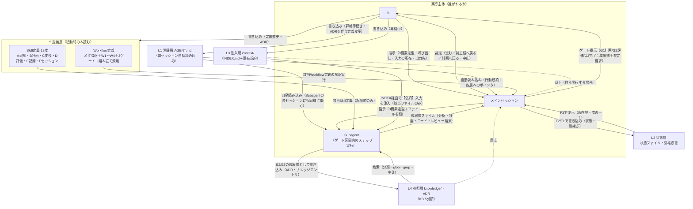
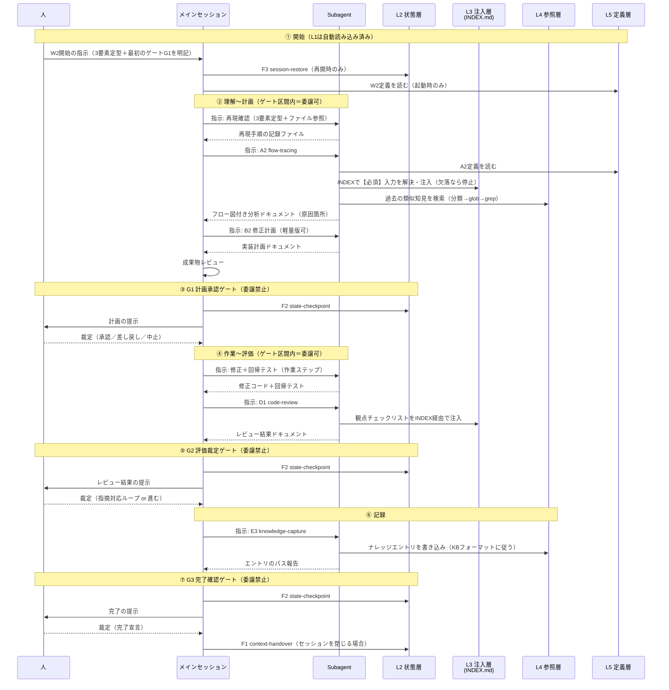

# 統合アーキテクチャ図 — 5層×実行主体の配線図

Phase 6（`requests/006-integrated-architecture.md`）の成果物1。`00-design-plan.md`（G1承認済み）の判断1（統合図の骨格＝5層×実行主体）と判断3（Subagentの位置づけ・委譲禁止3点）の展開である。

本書は**統合であって再設計ではない**。Phase 1〜5 の決定——19Skill体系（`../skills/01-skill-catalog.md`）・メタ骨格と3ゲート（`../workflows/01-workflow-catalog.md` 1〜3章）・5層配置モデル（`../context-rag/01-context-architecture.md` 2章）・KB 5分類（`../knowledge-management/`）・指示の3要素定型（`../instruction-methods/01-instruction-principles.md` 1章）——を再定義・変更せず、それらを1枚のアーキテクチャとして配線し直す。本フェーズで新たに規定するのは**実行主体としてのSubagentの位置づけ**（4章）だけであり、これはPhase 5がスコープ外として残した部分への、統合図に必要な最小限の回答である。

> **用語**: Phase 3 と同じく、常駐ファイルは汎用名 **AGENT.md**、ディレクトリも `context/`・`knowledge/` 等の汎用名で呼ぶ。特定ツールへの言及は参照実装としての引用（4.3）に限る。

---

## 1. 統合の視点 — 「いつ読むか」×「誰がやるか」の2軸

Phase 1〜5 の成果物は、それぞれ1つの問いに答えてきた。

| Phase | 答えた問い | 軸としての性格 |
|---|---|---|
| 1 Skills | どうやるか（手順） | 処理の単位 |
| 2 Workflows | どの順で・どこで人が裁くか | 処理の合成と裁定点 |
| 3 Context/RAG | **いつ読み込まれるか**（L1〜L5） | 知識の軸 |
| 4 KB | 蓄積知見をどう分類・検索するか | L4の内部構造 |
| 5 指示方法 | 人がどう起動するか | 起動の形式 |

このうち全要素を漏れなく座標づけられる軸は2本ある。**「いつ読むか」（Phase 3 の5層）**と**「誰がやるか」（実行主体）**である。前者はすべての知識・状態・定義の置き場を一意に定め、後者はすべての読み・書き・裁定の主体を一意に定める。Skill は L5 に置かれた定義が実行主体に読まれて動くもの、Workflow は L5 に置かれた編成定義を実行主体が解釈して進むもの、指示は人という実行主体から発される配線情報、KB は L4 の内部——というように、Phase 1〜5 の全成果物がこの2軸の平面上に**過不足なく載る**。だから統合図は「5層×実行主体」の配線図であり、新しい箱を1つも必要としない（判断1）。

実行主体は3つである。

| 実行主体 | 役割の一言 | 根拠 |
|---|---|---|
| **人** | ゲートの裁定者・L1/L3/L5の書き込み主体 | Phase 2 3章（ゲート＝人の判断点）、Phase 3 2章（書き込み主体） |
| **メインセッション** | Workflowの解釈実行・ゲート運営・L2の書き込み・Subagentへの指示出し | 判断3（4章で展開） |
| **Subagent** | ゲート区間内のステップ実行（成果物はファイルで返す） | 判断3（4章で展開） |

## 2. 統合アーキテクチャ図

全体を1枚に配線する。矢印のラベルは「何が流れるか」を示す。

読み方の要点:

- **左上→右下に権限が細る**。人はすべての層に（手続きを経て）書けるが裁定に専念し、メインセッションは L2 のみに書き、Subagent は成果物ファイルと L4（E2/E3経由）のみに書く。この勾配が4章の責務境界の図示である
- **知識の流れは Phase 3 のまま**である。L1 は毎回・全量、L2 は開始時に F3 経由、L3 は INDEX 経由で該当ファイルのみ、L4 は検索ヒット分のみ、L5 は起動時のみ（`../context-rag/01-context-architecture.md` 3章の読み込み勾配）。実行主体の軸を重ねても読み込みタイミングの規定は1文字も変わらない
- **指示は2箇所に現れ、どちらも同じ3要素定型**である（人→メインセッション、メインセッション→Subagent）。規定を分けない理由は Phase 5 の定型がそのまま適用できるため（判断3。学習コストを倍にしない）
- **ゲートの3本線（提示・裁定）は人とメインセッションの間にしか無い**。Subagent と人の間に直接の線は無い——ゲートは常にメインセッションが運営し、Subagent はゲートを跨がない
- **L1 は実行主体を問わず毎セッション自動で読まれる**。Phase 3 2章の「毎セッション自動」の「セッション」には Subagent の起動も含まれる——W3 停止規約（L1 常駐の中核文）が Subagent にも届く前提はこの線が担う。利用ツールが Subagent に常駐ファイルを自動供給しない場合は、メインセッションが指示の一部として L1 相当の規約到達を保証する（その確認手順は Phase 7 の運用設計に委ねる）
- Subagent への委譲は**任意**である（点線）。短いステップはメインセッションが自ら実行してよい。委譲するか否かで読み書きの経路は変わらない——変わるのは「誰のコンテキストで実行されるか」だけであり、成果物がファイルで残る（原則2）限り、どちらでも体系は同じに動く

## 3. 1タスクのライフサイクル — W2バグ修正を例に

人が W2 を指示してから G3 完了までを、実行主体×層の時系列で示す。Phase 3 の3章（セッションのライフサイクル）に実行主体の軸を加えた拡張版である。例は W2 の抽象記述（`../workflows/01-workflow-catalog.md` 5章のステップ番号）に留め、特定プロジェクトの具体事例は作らない。

読み方の要点:

- **③⑤⑦のゲート運営とL2書き込みは、常にメインセッションと人の間で閉じる**。Subagent は②④⑥のゲート区間内にしか現れない
- Subagent のコンテキストはステップごとに消滅するが、②④⑥のすべての戻り線が**ファイル**である（原則2）ため、消滅は問題にならない。次のステップへの入力は前のステップの成果物ファイルのパスとして渡される
- Subagent 内でも W3 停止規約は同じに働く（②で INDEX の【必須】入力が欠落していれば、Subagent は開始せず停止をメインセッションに報告し、メインセッションが人に要求を上げる）。停止の連鎖も配線どおり一方向である

## 4. 実行主体の責務境界

### 4.1 責務表

| 責務 | 人 | メインセッション | Subagent |
|---|---|---|---|
| ゲート裁定（G1/G2/G3） | **専任** | ✕（提示のみ） | ✕ |
| ゲート運営（提示・裁定受領・F2） | — | **専任** | ✕ |
| Workflow解釈・シナリオ判定・指示出し | 起動指示 | **専任** | ✕ |
| ゲート区間内のステップ実行（A/B/C/D系・作業ステップ・執筆） | — | 可 | **既定の担い手** |
| E2/E3 による L4 書き込み | — | 可 | 可 |
| F1/F2/F3 による L2 読み書き | — | **専任** | ✕ |
| L1/L3/L5 への書き込み | **専任**（昇格・ADR手続き） | ✕ | ✕ |
| 成果物レビュー（Subagent出力の検収） | 最終裁定 | **専任** | ✕（D2自己評価は可） |

### 4.2 委譲禁止の3点

Subagent へ委譲してはならないのは次の3点である（`00-design-plan.md` 判断3）。

1. **ゲート裁定** — ゲートは人の判断点である（Phase 2 3章）。Subagent どころか**メインセッションにも委譲されない**。委譲を禁じる根拠は、ゲートが「AIが自動で先に進んではならない地点」として定義されていることそのものにある。実行主体をいくら増やしても、裁定者は人の1系統のまま変わらない。
2. **L1/L3/L5 への書き込み** — これらの層の書き込み主体は人間の明示的な手続き（昇格・ADR）に限定済みである（Phase 3 2章）。Subagent はおろかメインセッションにも書けないのだから、委譲の余地は最初から無い。統合図はこの既定を実行主体の軸で再確認しただけである。
3. **F1/F2 による L2 更新** — セッションの現在地は**1系統**でなければならない。Subagent が並行して状態を書くと L2 の「正」が割れ、F3 復元が壊れる。Subagent は自分の作業経過を成果物ファイルとして残せばよく、それを L2 に反映するのは全体を見ているメインセッションの仕事である。

3点の共通原理は「**1系統であるべきものに主体を増やさない**」である。裁定は人の1系統、L1/L3/L5 は人間の手続きの1系統、L2 はメインセッションの1系統。逆に言えば、これ以外——ゲート区間内のステップ実行と、その成果物としての L4 書き込み（E2/E3）——はすべて委譲可能である。委譲可能な範囲が広いのは、原則2（成果物駆動）が「実行主体が誰であっても結果はファイルで残る」ことを保証しているからで、委譲の安全性は Subagent の設計ではなく Phase 1 の原則が担保している。

### 4.3 参照実装

本リポジトリ自身の CLAUDE.md「サブエージェント運用ルール」が、この責務境界の参照実装である。同ルールは「メインセッションは設計判断・監査・レビューに専念する」とし、メインセッションの責務に「フェーズの計画・方針決定／サブエージェントへの指示出し／成果物レビュー／`docs/` 配下の状態管理ファイル更新（＝L2書き込み）／ADRの作成・承認」を、サブエージェントへの委譲対象に「リサーチ／成果物ドキュメントの執筆／整合性チェック／大量のファイル読み込み」を挙げ、指示テンプレートとして「目的・入力・出力・制約・レビュー観点」の明示を義務づけている。委譲禁止3点と3要素定型（入力・出力の明示）が実運用で機能している実例として引ける。ただし規定はあくまで本章の抽象定義であり、CLAUDE.md の記述はその一実装にすぎない。

## 5. 技術要素の配置 — 図に現れるもの・現れないもの

Phase 6 で採否を判定した技術要素（採否理由・再検討条件の詳細は `02-technology-decisions.md` に委ねる。本章は図上の位置の確認のみ）。

**採用要素は、すべて図の既存の箱・線に対応する**。

| 採用要素 | 図上の位置 |
|---|---|
| Subagent | 実行主体の3つ目の箱（2章）。ゲート区間内のステップ実行者（4章） |
| Memory（ファイルベース） | L2 状態層（今）＋L4 参照層（蓄積）。書き込みは F1/F2・E2/E3 の線 |
| RAG（agentic・ファイルベース検索） | L4 からの「検索（分類→glob→grep→中身）」の線。実行主体自身が検索を駆動する |

**不採用要素は、図のどこにも現れない**。これは記載漏れではなく設計である。

| 不採用要素 | 図に現れないことの意味 |
|---|---|
| ベクトルDB | L4 の検索線は grep/glob で完結し、embedding 基盤の箱を要しない（ADR-0002 の再確認） |
| Knowledge Graph | 関係は L4 内部の失効ポインタ・ADR置換関係・タグで表現済みで、専用グラフの箱は写しになる |
| Workflow Engine | Workflow は L5 の定義をメインセッションが解釈実行する（2章の線）。ゲート裁定が人にある以上、決定論的エンジンの箱は置けない |
| MCP | 全部の線がファイルシステム＋標準ツール（read/glob/grep）で引ける。外部システムの箱が現状の図に無い以上、接続規格も要らない（体系は MCP を禁じないが、依存しない） |

図が「ファイルと3つの実行主体だけで閉じている」ことが、本体系の導入コスト（`docs/principles.md`）の主張の視覚的な証明になっている。

---

## 自己レビュー（docs/principles.md の10軸）

| 軸 | 評価 | 根拠・弱点 |
|---|---|---|
| 汎用性 | 強 | 図の全要素が汎用名（AGENT.md・`context/`・Subagent）で、特定ツールへの言及は参照実装の引用（4.3）に隔離した。W2の例も抽象記述に留めた |
| 再利用性 | 強 | 2章の配線図は Phase 1〜5 の体系ごと別プロジェクトに持ち出せる。プロジェクト固有なのは層の中身だけで、配線は共通 |
| 保守性 | 強 | Phase 1〜5 の規定を複製せず「ファイルパス＋章番号」の参照で示した。本書が独自に持つのは実行主体の軸（4章）だけで、既存規定が変わっても本書の修正箇所は参照先の追随に限られる |
| スケーラビリティ | 中 | 実行主体を3つに固定した図であり、Subagent の並列編成（複数Subagentの同時実行・通信）には拡張が要る。これは意図的な繰り延べ（Phase 7 スコープ）だが、図の骨格がそのまま持つかは未検証 |
| 長期運用 | 強 | 委譲禁止3点は「1系統であるべきものに主体を増やさない」の1原理に還元されており、半年後に個別ルールを忘れても原理から再導出できる |
| AIとの相性 | 強 | 委譲可否が責務表（4.1）の○✕で機械的に判定でき、解釈の余地がない。指示の形式が2箇所とも同一定型で、主体によって書き分ける判断が発生しない |
| トークン効率 | 強 | Subagent への委譲はメインセッションのコンテキスト消費を成果物ファイルのパス受領だけに圧縮する。読み込み勾配（Phase 3）は実行主体を増やしても保存される |
| コンテキスト効率 | 強 | Subagent はステップに必要な入力（3要素＋INDEX注入）だけを持って起動し、メインセッションの経緯を引きずらない。戻りはファイルのみ |
| 学習コスト | **中〜弱（自己申告）** | 5層＋19Skill＋ゲート規律の上に、実行主体の責務境界（禁止3点・責務表8行）がさらに載る。緩和策は「1系統原理」への圧縮と、委譲の既定が任意（迷ったらメインセッションが自分でやってよい）であることだが、体系全体の規律総量は Phase 3 時点の最大弱点をさらに積み増している |
| 導入コスト | 強 | 新要素の導入がゼロ（Subagent は利用ツールの既存機能、他はすべてファイル）。図の全配線が Phase 1〜5 の実装済み要素（`skills/`・`workflows/`・`scaffold/`）で今日から引ける |

**総評**: 本書の価値は新規性ではなく「新規性が無いことの証明」にある——Phase 1〜5 の決定だけで全体が1枚に配線でき、統合のための追加要素が不要であることを図で示した。唯一の新規定（Subagentの位置づけ）も、委譲禁止3点を「1系統原理」に還元することで既存規定（ゲート＝人の判断点・層の書き込み主体・L2の単一性）の帰結として導出しており、独立した新ルールを増やしていない。弱点は一貫して学習コスト（規律総量の積み増し）と、並列編成へのスケーラビリティ未検証（Phase 7 へ繰り延べ）である。
