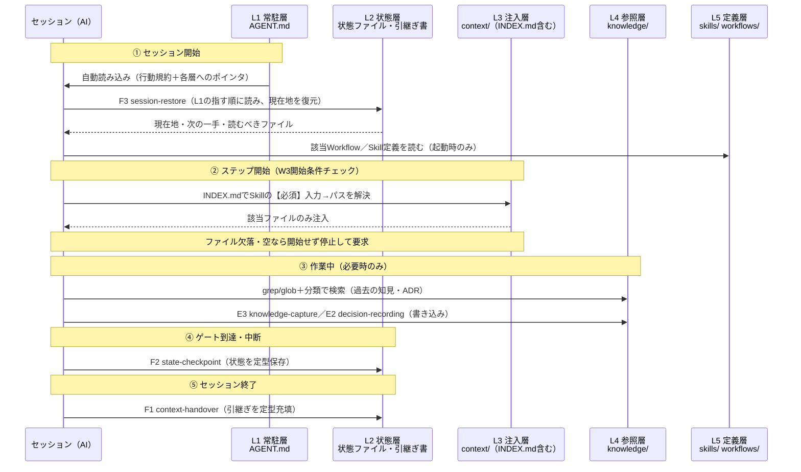

# Context/RAGアーキテクチャ — 5層配置モデル

Phase 3（`requests/003-rag.md`）の成果物1。知識・状態・定義を「いつ読み込まれるか」で5つの層に配置するモデルを定義し、各層の参照方向と、Phase 2原則W3（入力欠落時の停止規約）を実行時に強制する仕掛けを示す。

`00-design-plan.md`（G1承認済み）の判断1・5の展開である。Phase 1の6原則（`../skills/02-design-principles.md`。特に原則1注入・原則2成果物駆動）およびPhase 2の原則（`../workflows/02-orchestration-principles.md`。特にW3停止規約・W6一方向依存）を前提とし、これらと矛盾しない。何をどの層に置くかの判定基準は `02-placement-criteria.md`、層の間の移動（昇格・降格）と鮮度管理は `03-maintenance-cycle.md` が定める。

> **用語**: 本書では常駐ファイルを汎用名 **AGENT.md** と呼ぶ。Claude CodeのCLAUDE.mdなど、各ツールが毎セッション自動で読み込むファイルがこれに当たる。ディレクトリ名（`context/`・`knowledge/` 等）も同様に汎用名であり、実プロジェクトでの物理名は自由でよい——層の定義（読み込みタイミングと責務）だけが規定である。

---

## 1. 設計の中心視点 — 「内容の種類」ではなく「読み込みタイミング」で層を切る

### なぜこの切り方か

`docs/principles.md` の責務分離フレーム（Context／RAG・KB／Memory）は「何を置くか」の分類を与えるが、トークン効率・コンテキスト効率の実害を決めるのは内容の種類ではなく「**いつ・どれだけ読み込まれるか**」である。同じ知識でも、常駐すれば全セッションで固定費になり、必要時にだけ引けば無害になる。逆に、必要な規約が必要な時に読み込まれなければ、AIは推測で補完して誤動作する（原則W3が禁じた事態）。

そこで層の定義そのものを読み込みタイミングで与え、「何を置くか」は各層への配置基準（`02-placement-criteria.md` の3テストとL3/L4判定）として従属させる。この順序にすることで、配置の議論が「この情報は大事か」という水掛け論ではなく「この情報はいつ要るか」という判定可能な問いになる。

## 2. 5層の定義

| 層 | 実体（例） | 読み込みタイミング | 置くもの | 書き込み主体 |
|---|---|---|---|---|
| **L1 常駐層** | AGENT.md | 毎セッション自動 | 行動規約＋状態ファイルへの入口＋各層へのポインタ | 人間のみ（昇格手順経由） |
| **L2 状態層** | 状態ファイル・引継ぎ書 | セッション開始時（F3経由） | 現在地・引継ぎ | F2 / F1 |
| **L3 注入層** | `context/` | Workflowステップ開始時、該当ファイルのみ | 現在有効なプロジェクト固有の判断基準 | 人間＋昇格手順 |
| **L4 参照層** | `knowledge/`・ADR置き場 | 必要時に検索 | 事実・経緯・蓄積知見 | E3 / E2 |
| **L5 定義層** | `skills/` `workflows/` | 起動時のみ | Skill・Workflow定義 | 人間（変更はADRを伴う） |

### L1 常駐層（AGENT.md）

- **置くもの**: ①行動規約のうち常時有効なもの（W3停止規約・推測補完禁止・ゲート規律W4の要点等） ②セッション開始時に読むべき状態ファイルの場所と順序（L2への入口） ③各層の場所と引き方（「固有規約は `context/INDEX.md` から引く」「知見は `knowledge/` をgrepする」等のポインタ）
- **置かないもの**: 知識の実体（規約の詳細・チェックリスト・テンプレート本文）、現在地・進行状態（→L2）、手順・編成（→L5）。判定基準は3テスト（`02-placement-criteria.md`）
- **読み込みタイミング**: 毎セッション、ツールにより自動。**この層だけが「必ず読み込まれる」保証を持つ**（この性質が4章の強制の足場になる）
- **書き込み主体**: **人間のみ**。それも `03-maintenance-cycle.md` の昇格手順を経由した場合に限る。E3・F系を含むどのSkillもL1には書き込まない（AGENT.md直行禁止）

### L2 状態層（状態ファイル・引継ぎ書）

- **置くもの**: 現在地（今どの作業のどこにいるか・完了済み・次の一手）と引継ぎ（確定事項・保留事項・読むべきファイル）。このリポジトリでの実体は `docs/current-state.md` と `docs/handoff.md`
- **置かないもの**: 恒久的な知識。作業中に得た知見・事実はE3でL4へ書く。L2はセッション単位で書き換わる「今」だけを持ち、履歴を蓄積しない
- **読み込みタイミング**: セッション開始時に**F3 session-restore経由で**読む。F3を通さない再開は原則W4により禁止されている
- **書き込み主体**: **F2 state-checkpoint**（ゲート到達時・中断時）と**F1 context-handover**（セッション終了時・他エージェントへの引継ぎ時）。両者ともF系共通制約により定型テンプレートの機械的充填のみで、自由な要約をしない

### L3 注入層（`context/`）

- **置くもの**: **現在有効なプロジェクト固有の判断基準**——命名規則・アーキテクチャ層の定義・レビュー観点チェックリスト・テスト実行コマンド・各種テンプレート（引継ぎ・状態・ADR）等、Skillの前提入力欄に注がれる中身。加えて**知識マニフェスト `context/INDEX.md`**（4章）
- **置かないもの**: 事実・経緯・蓄積知見（→L4）、失効した規約（→L4へ降格または削除）。「従うもの」だけを置き、「引くもの」を混ぜない
- **読み込みタイミング**: **Workflowステップの開始時**に、そのステップで使うSkillの前提入力【必須】に応じて**該当ファイルのみ**（パス解決はINDEX経由）。全ファイルの一括読み込みはしない
- **書き込み主体**: 人間、または `03-maintenance-cycle.md` の昇格①の手順。E3はL3に直接書かない（新知識の既定の行き先はL4であり、L3への収載は昇格という明示的な手続きを要する）
- Phase 1・2から持ち越された「プロジェクト固有知識の恒久的な置き場はどこか」（原則1の注入元、原則W6の『固有値の出どころは常にContext/Knowledge側の1系統』）への回答が、この層である

### L4 参照層（`knowledge/`・ADR置き場）

- **置くもの**: **事実・経緯・蓄積知見**——過去のバグ対処・ハマりどころ・調査結果・外部APIの仕様メモ・ADR（決定の経緯と選択肢を含む記録）。このリポジトリでの実体は `research/notes/` や `docs/decisions/` が相当する
- **置かないもの**: 現在有効な規約（→L3）。過去の記録から抽出された「今後こうする」はL4に置いたままにせず、規約としてL3へ収載する（昇格①）
- **読み込みタイミング**: **必要になった時に検索して引く**。検索手段はgrep/glob＋INDEX・分類経由であり、Vector DBは使わない（ADR-0002。運用の詳細は `03-maintenance-cycle.md` 7章）
- **書き込み主体**: **E3 knowledge-capture**（知見）と**E2 decision-recording**（ADR）。いずれもE系共通制約（差分駆動・既存エントリとの重複確認）に従う
- KB内部の分類体系・ディレクトリ構造の詳細設計はPhase 4のスコープ。本書はL4という層の責務と読み書きの経路のみを定める

### L5 定義層（`skills/` `workflows/`）

- **置くもの**: Skill定義（19本＋6原則）とWorkflow定義（テンプレート4本＋メタ骨格・組み立て規則）
- **置かないもの**: プロジェクト固有値（Phase 1原則1・Phase 2原則W6により、固有値はSkillにもWorkflowにも埋め込まない。注入点の宣言まで）
- **読み込みタイミング**: **起動時のみ**——そのSkill/Workflowを使う時に該当定義だけを読む。常駐しない
- **書き込み主体**: 人間。原則・定義の変更はADR（E2）を伴う（Phase 1・2の冒頭規約）

## 3. アーキテクチャ図 — セッションのライフサイクルに沿って

何がどこに置かれ、いつ読み込まれ、いつ書き込まれるかを、1セッションの流れで示す。



読み方の要点:

- **読み込みの総量は右の層ほど少ない**。L1は全量・毎回、L2は開始時に一度、L3は該当ファイルのみ、L4は検索でヒットした分のみ、L5は使う定義のみ。トークン効率・コンテキスト効率はこの勾配で担保される
- **書き込みはすべてSkillの成果物として行われる**（L2=F1/F2、L4=E2/E3）。Phase 1原則2（成果物駆動）の帰結であり、「会話の中だけの結論」がどの層にも発生しない。例外はL1・L3・L5への書き込みで、これは人間の明示的な手続き（昇格・ADR）に限定される
- ①のF3と⑤のF1/F2が対になっており、セッションを跨ぐ情報はすべてL2を経由する。会話ログは持ち越さない

## 4. W3停止規約の実行時強制 — L1の規約＋L3のマニフェスト

### なぜ仕掛けが要るか

Phase 2は自己レビューで「W3の停止規約は明文化したが、実行時にどう強制するかはPhase 3に残る」と自己申告した。「止まって聞く」はAIの苦手な挙動（もっともらしく補完する傾向の抑制）であり、規約を書いただけでは守られる保証がない。

強制を分解すると、次の2条件に還元できる。

1. **規約が確実に読み込まれていること**——読まれていない規約は存在しないのと同じ
2. **判定が解釈に依存しないこと**——「入力が十分か」をAIの自己判断に委ねると、補完傾向がそのまま判定を侵食する

この2条件に、それぞれL1とL3で答える。

### 4.1 足場: 停止規約はL1に常駐させる

5層のうち「毎セッション必ず読み込まれる」保証を持つのはL1だけである。したがってW3停止規約（の常時有効な中核文——「ステップ開始時に【必須】入力の充足をINDEXで確認し、欠落なら開始せず停止して要求する。推測による補完を禁止する」）はL1に置く。これは3テストのT2（誤動作防止: 読み込まれないとAIの挙動が壊れる規約）の典型例である。

### 4.2 地図: 知識マニフェスト `context/INDEX.md`

L3に**知識マニフェスト**を1ファイル置く。これは「Skillの前提入力【必須】→それを満たすファイルのパス」の対応表であり、**この対応の唯一の置き場**とする。

- **L1はマニフェストの場所だけを指す**（「必須入力のパスは `context/INDEX.md` で引く」という1行）。対応表の実体をL1に複製しない。地図の実体を2箇所に持つと、Skillの前提入力が変わるたびに2箇所の同期が必要になり、評価軸「保守性: 直す場所は1箇所」に反する
- WorkflowもSkill定義も具体パスを持たない。Workflow定義が指定するのは「Contextから注入する」という注入点まで（原則W6）、Skill定義は前提入力欄の宣言まで（原則1）であり、**パス解決はすべてINDEXが担う**。ファイルを移動・改名しても直すのはINDEXの1行だけである

マニフェストの具体例:

```markdown
# context/INDEX.md — 知識マニフェスト

Skillの前提入力【必須】と、それを満たすファイルの対応表。この対応の唯一の置き場。
ステップ開始時、該当行のパスに「ファイルが存在し空でない」ことを確認してから開始する。
欠落していれば開始せず、ユーザーに要求して停止する（L1停止規約）。

| 前提入力【必須】 | 利用Skill | パス |
|---|---|---|
| レビュー観点チェックリスト | D1 code-review | context/review-checklist.md |
| 命名規則・アーキテクチャ層の定義 | C1 refactor-rename / C3 refactor-restructure | context/naming-and-layers.md |
| テスト実行コマンド | C系共通・実装ステップ | context/test-commands.md |
| ドキュメントの文体・構成規約 | E1 documentation-update | context/doc-style.md |
| ADRテンプレートと採番規則 | E2 decision-recording | context/templates/adr.md |
| ナレッジベースの構成と記録フォーマット | E3 knowledge-capture | context/kb-format.md |
| 引継ぎテンプレート | F1 context-handover | context/templates/handover.md |
| 状態ファイルのフォーマットと置き場 | F2 state-checkpoint | context/templates/state.md |
| セッション開始時に読むファイルの規約 | F3 session-restore | AGENT.md 冒頭（L1に常駐） |
```

最終行が示すとおり、マニフェストはL3外のファイル（L1常駐の規約）を指してもよい。マニフェストの責務は「対応の一元管理」であって「L3ファイルの目次」ではない。なお各ファイルの更新日はファイル自身の先頭メタデータを正とし、INDEXには持たせない（写しは古びる。`03-maintenance-cycle.md` 6章）。

### 4.3 判定の機械化: 「ファイルが存在し空でないか」

ステップ開始条件の充足確認を、次の機械的判定に還元する。

> **INDEXの該当行が指すパスに、ファイルが存在し、空でないか。**

判定結果は3通りで、いずれも解釈の余地がない。

| 判定結果 | 挙動 |
|---|---|
| 行があり、ファイルが存在し空でない | 該当ファイルを注入してステップ開始 |
| 行はあるが、ファイルが無い・空 | **開始せず停止**。「どのステップの・どの前提入力が・なぜ必要か」を明示して要求（W3運用規定） |
| 【必須】入力に対応する行そのものが無い | **開始せず停止**。マニフェスト未整備として、入力の手渡しかINDEX整備を要求 |

これはPhase 2原則W5がスキップ判定を「成果物ファイルの存在」に還元したのと同型の手筋である。「入力が十分か」というAIの解釈に委ねると補完傾向に侵食される判定を、「ファイルがあるか」というファイルシステムへの問い合わせに置き換える。3つ目のケースが重要で、**マニフェスト自体の欠陥（登録漏れ）も同じ停止規約で検出される**——地図に無い場所へは進めない。

### 4.4 限界（トレードオフの明記）

この仕掛けは**意図的に「存在」までしか判定しない**。

- **内容の正しさ・鮮度は保証しない**。ファイルは存在するが中身が古い・実態と矛盾している場合、判定は素通りする。ここは鮮度管理（更新日メタデータ・矛盾発見時の即時修正、`03-maintenance-cycle.md` 6章）が補完する。存在判定に内容判定を混ぜなかったのは、「内容が適切か」の判定は解釈依存であり、それを開始条件に入れると4.3で排除したはずの解釈のブレが戻ってくるからである
- **最終的にAIが規約に従うことの保証は確率的である**。この仕掛けは「破られにくくする」（規約を必ず読み込ませ、判定から裁量を除く）ものであって、「破れなくする」ものではない。ツールのフック機構等でファイル存在チェックを物理的に強制することも可能だが、特定ツールへの依存（汎用性の毀損）になるため本設計では規定せず、各ツールでの任意の追加実装に委ねる

## 5. 参照方向 — 誰が誰を知るか

Phase 2原則W6の一方向依存（WorkflowはSkillを知るが、SkillはWorkflowを知らない）を5層全体に拡張する。

| 参照元 → 参照先 | 知ってよいこと | 知ってはならないこと |
|---|---|---|
| L1 → L2/L3/L4/L5 | 各層の**場所と引き方**（ポインタ） | 各層の内容（実体の複製・転載） |
| L5 Workflow → L5 Skill | Skill **ID**（A1〜F3） | Skillの手順の中身への依存 |
| L5 Skill → L3 | 「Contextから注入」という**入力欄の宣言**まで | 注入される中身・**具体パス**（パスはINDEXが持つ） |
| L2 → 成果物・L4 | 事実としてのファイルパスの列挙 | —（L2は状態の記録なので実体を持たない） |
| L3 / L4 → 他層 | **参照しない**（参照される専用） | L1・L2・L5への参照。例外: L4エントリ間の相互リンクは可 |

- **依存の連鎖は一方向に閉じる**: Workflow →（ID）→ Skill →（入力欄）→ INDEX →（パス）→ L3ファイル。逆向きの参照は無い。L3の規約ファイルは自分がどのSkillに使われるかを知らず、SkillはどのWorkflowから使われるかを知らない。この非対称性が保たれている限り、規約ファイルの改訂がSkill定義を壊さず、Skillの差し替えがWorkflow定義の参照（ID）を変えない——W6が層内で守った性質の、層間への拡張である
- **INDEXの「利用Skill」列は依存ではなく索引である**: INDEXはSkill定義の前提入力欄の宣言に**追随して**保守される（Skill側は INDEX を知らない）。Skillの前提入力が増減したらINDEXを直す、という保守の向きも一方向に保たれる
- **L1を参照するものは無い**: L1は自動で読み込まれるためのファイルであり、他の定義がL1の内容に依存した記述を持ってはならない。L1は最も頻繁に棚卸しされる（=変わる）層であり、そこへの依存は最も壊れやすい依存になる

## 6. Phase 1・2との整合の確認

| 上位原則 | 本アーキテクチャでの実現 |
|---|---|
| 原則1（注入） | L3が注入される固有知識の恒久的な置き場。Skillは入力欄、Workflowは注入点、パス解決はINDEX、実体はL3——固有知識の出どころが1系統に閉じた |
| 原則2（成果物駆動） | L2・L4への書き込みはすべてSkill（F1/F2/E2/E3）の成果物ファイル。会話にしか無い状態・知識が構造上発生しない |
| 原則5例外（F系厳格） | L2への書き込みは定型テンプレート充填のみ。テンプレート自体はL3に置かれ、INDEXから引かれる |
| W3（停止規約） | 4章。L1常駐＋INDEX＋存在判定への還元により実行時強制の仕掛けを充足（Phase 2保留事項の解消） |
| W4（ゲート＝チェックポイント） | ゲート到達時のF2書き込み先・F3復元元としてL2が機能する |
| W6（一方向依存） | 5章。参照方向を層間に拡張し、固有値の置き場を1系統（L3）に確定 |

---

## 自己レビュー（docs/principles.md の10軸）

| 軸 | 評価 | 根拠・弱点 |
|---|---|---|
| 汎用性 | 強 | 層の定義は読み込みタイミングと責務のみで与えられ、特定ツール・言語・ディレクトリ物理名に依存しない。AGENT.md・`context/` 等は汎用名で、実装名は自由 |
| 再利用性 | 強 | 5層モデルとINDEXの仕組みは、Skill/Workflow体系ごと別プロジェクトに持ち出せる。プロジェクト固有なのはL2〜L4の中身だけで、器は共通 |
| 保守性 | 強 | 【必須】入力→パスの対応はINDEXの1箇所、固有知識の実体はL3の1箇所、状態はL2の1箇所。地図の実体を2箇所に持たない規定（4.2）を明示した |
| スケーラビリティ | 中 | 読み込み量は知識総量ではなく「該当ファイルのみ・検索ヒット分のみ」に比例するため、L3/L4の成長に耐える。**弱点**: INDEXは1ファイルなので、Skill数×固有入力数が大きく増えると表自体が肥大する。現行19Skillでは10行前後で問題ないが、再編手順は未設計（Phase 1の「30超時のカテゴリ再編未設計」と同型） |
| 長期運用 | 中 | 各層の書き込み主体と経路が固定されており、半年後も「どこに書くか」で迷わない。**弱点**: INDEXが単一障害点であり、INDEXの保守が怠られると停止規約が誤動作（誤停止・誤通過）する。棚卸しでのINDEX検査（03の5章）に依存する |
| AIとの相性 | 強 | 開始条件を「ファイルが存在し空でないか」という解釈余地のない判定に還元した。層ごとの読み込みタイミングが固定なので「今何を読むべきか」の解釈もブレない |
| トークン効率 | 強 | 常駐はL1のみ（分量予算は02で規定）。L3は該当ファイルのみ、L4は検索ヒット分のみ、L5は起動時のみという読み込み勾配を層の定義に組み込んだ |
| コンテキスト効率 | 強 | ステップ開始時に注入されるのは当該Skillの【必須】入力だけで、無関係な規約・知見は持ち込まれない。セッション間の持ち越しはL2経由に限定され、会話履歴を引きずらない |
| 学習コスト | **中〜弱（自己申告）** | 5層＋書き込み経路＋参照方向は、Phase 1の19Skill・Phase 2のゲート規律の上にさらに載る記憶量である。緩和策: 運用時に覚えるべきことは「書くときの行き先は03の表で引く」「ステップ開始はINDEXで引く」の2点に圧縮され、層の理論は設計時にだけ要る。それでも規律の総量は増え続けており、体系全体の学習コストはPhase 3時点で最大の弱点である |
| 導入コスト | 強 | 最小構成はAGENT.md＋INDEX＋L3ファイル数枚で始められる。Vector DB等の基盤導入が不要（ADR-0002）で、既存のCLAUDE.md運用からは「追い出してポインタ化」する移行だけで到達できる（02の6章） |

**総評**: Phase 1・2と同じく、学習コストを意図的に犠牲にして、保守性（直す場所1箇所）・トークン効率（読み込み勾配）・AIとの相性（機械的判定）を取った設計である。本Phase固有のリスクはINDEXへの一極集中（保守性の裏返し）であり、その健全性維持は `03-maintenance-cycle.md` の棚卸し手順に委ねられている。
